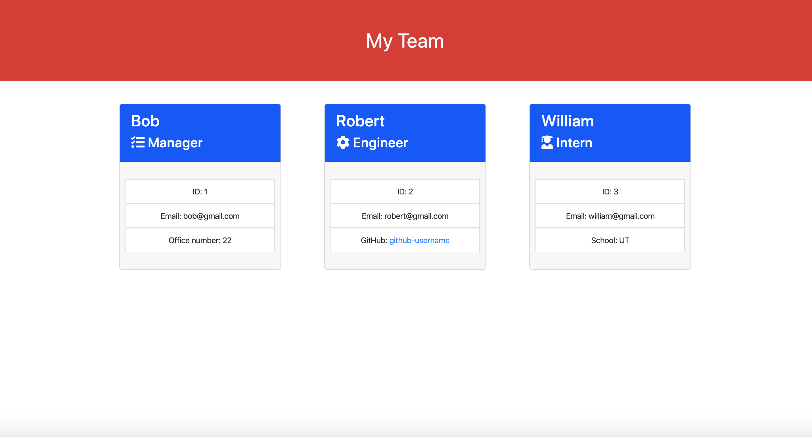

# Team-Profile-Generator

This is a CLI (Command Line Interface) software engineering team profile generator that runs through Node.js. The user is informed that a team consists of one manager and any number of engineers and interns, and is then prompted for team information through Inquirer. When the prompts are finished, a "team.html" page is generatd in the output folder. To run the app, the user needs to install the relevant dependency ("npm install inquirer") and then run the app through Node.js ("node app.js"). This project relied on the TDD (Test Driven Development) model. As such, this project was first designed to pass the tests in the "tests" folder. Basic RegEx validation techniques were used to catch some potential errors in user inputs.

 